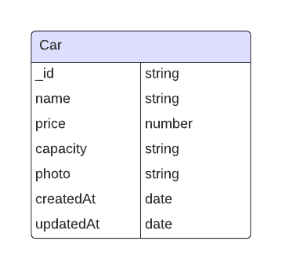

# Car Dashboard Management 

## 📖 Database Diagram 


## 🛠 Tech Stack <a name="built-with"></a>
<details>
  <summary>Client</summary>
  <ul>
    <li>EJS</li>
  </ul>
</details>

<details>
  <summary>Server</summary>
  <ul>
    <li> ExpressJS </li>
  </ul>
</details>

<details>
<summary>Database</summary>
  <ul>
    <li> MongoDB </li>
  </ul>
</details>

## How To Run Server

1. Clone File 
```bash
git clone https://github.com/Hafieddz/F-FSW24001086-km6-haf-carDashboard-ch4.git
```
2. Buat File .env yang berisikan
```bash
PORT= #port yang ingin digunakan
DATABASE_URI= #connection string mongoDB 
SECRET_SESSION= #isi dengan random value saja..
```
3. Install package dan run
```bash
# Install package
$ npm install
# Run Server
$ npm start
```  

## Import / Delete Data
```bash
# Command Untuk Import Data ke Database
$ npm run import-data

# Command Untuk Delete Semua Data di Database
$ npm run delete-data
```
## Penggunaan API
1. Get Car Data (GET) = /api/v1/cars
```bash
Contoh Response -> 
{
    "status": "Success",
    "totalData": 3,
    "cars": {
        "cars": [
            {
                "_id": "6608d74c95cb410e8db29207",
                "nama": "Honda Brio",
                "price": 925000,
                "capacity": "Small",
                "photo": "car-default.png",
                "createdAt": "2024-03-31T03:23:06.868Z",
                "__v": 0
            },
            {
                "_id": "6608d77595cb410e8db2920c",
                "nama": "CRV",
                "price": 2000000,
                "capacity": "Medium",
                "photo": "car-default.png",
                "createdAt": "2024-03-31T03:23:06.868Z",
                "__v": 0
            },
            {
                "_id": "6608d78a95cb410e8db2920f",
                "nama": "Pajero",
                "price": 3000000,
                "capacity": "Large",
                "photo": "car-default.png",
                "createdAt": "2024-03-31T03:23:06.868Z",
                "__v": 0
            }
        ]
    }
}
```

2. Get Car Data By ID (GET) = /api/v1/cars/:id
```bash
Contoh Response -> 
{
    "status": "Success",
    "car": {
        "car": {
            "_id": "6608d74c95cb410e8db29207",
            "nama": "Honda Brio",
            "price": 925000,
            "capacity": "Small",
            "photo": "car-default.png",
            "createdAt": "2024-03-31T03:23:06.868Z",
            "__v": 0
        }
    }
}
```

3. Create New Data (POST) = /api/v1/cars
```bash
Contoh Body Request ->
{
    "nama" : "Honda Jazz",
    "price" : 1250000,
    "capacity" : "Small"
}
```
```bash
Response ->
{
    "status": "Success",
    "data": {
        "car": {
            "nama": "Honda Jazz",
            "price": 1250000,
            "capacity": "Small",
            "photo": "car-default.png",
            "createdAt": "2024-03-31T22:35:57.174Z",
            "_id": "6609e6a730ae79e2ebb8bfc7",
            "__v": 0
        }
    }
}
```

4. Update Car Data By ID (PATCH) = /api/v1/cars/:id
```bash
id = 6609e6a730ae79e2ebb8bfc7
Request Body -> {
    "nama" : "Fortuner",
    "price" : 3000000,
    "capacity" : "Large"
}
```

```bash
Response -> 
{
    "status": "Success",
    "message": "Data berhasil di update",
    "data": {
        "car": {
            "_id": "6609e6a730ae79e2ebb8bfc7",
            "nama": "Fortuner",
            "price": 3000000,
            "capacity": "Large",
            "photo": "car-default.png",
            "createdAt": "2024-03-31T22:35:57.174Z",
            "__v": 0
        }
    }
}
```

5. Delete Car Data (DELETE) = /api/v1/cars/:id
```bash
id = 6609e6a730ae79e2ebb8bfc7

Response -> 
{
    "status": "Success",
    "message": "Data deleted successfully",
    "data": {
        "deletedCar": {
            "_id": "6609e6a730ae79e2ebb8bfc7",
            "nama": "Fortuner",
            "price": 3000000,
            "capacity": "Large",
            "photo": "car-default.png",
            "createdAt": "2024-03-31T22:35:57.174Z",
            "__v": 0
        }
    }
}
```